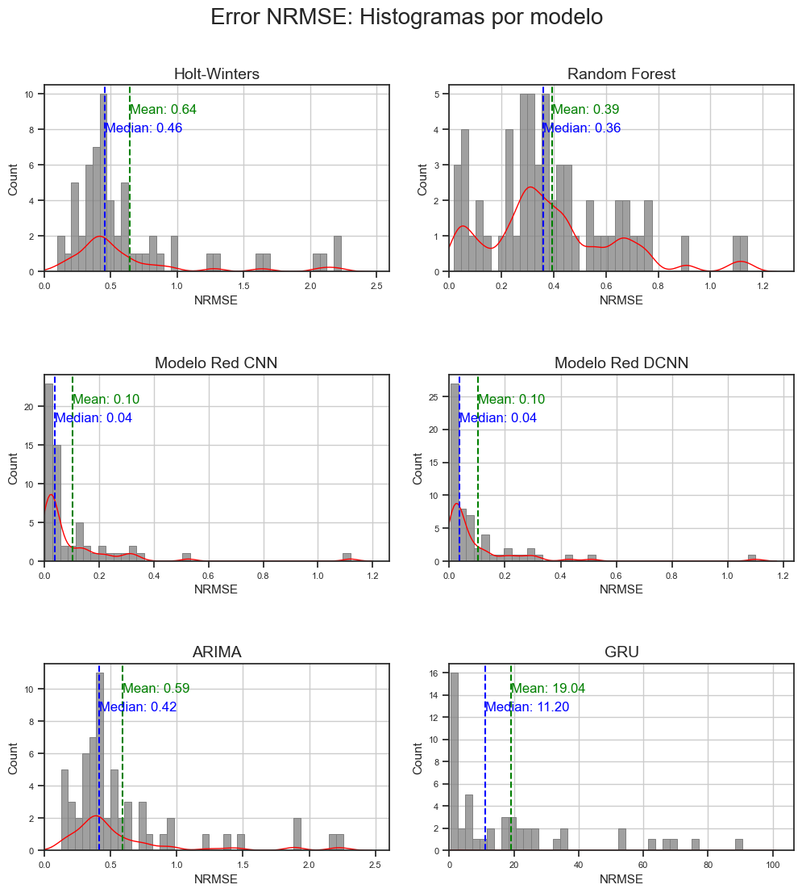

# **The M4 Competition: Prediction of Time Series Exercise**

### Author: Gregorio Mendoza Serrano 

# 0. Introduction   

Note: This notebook is prepared to run in a local environment  

The M4 dataset consists of time series data at annual, quarterly, monthly, and other frequencies (weekly, daily, and hourly), divided into training and testing sets. The minimum number of observations in the training test is 13 for annual series, 16 for quarterly, 42 for monthly, 80 for weekly, 93 for daily, and 700 for hourly. Participants were asked to make the following number of forecasts beyond the available data: six for annual series, eight for quarterly, 18 for monthly, 13 for weekly, and 14 and 48 forecasts respectively for daily and hourly.

The M4 Competition dataset can be found here:
https://doi.org/10.1016/j.ijforecast.2019.04.014

During this exercise, 60 time series will be randomly selected from all contained in the M4 dataset, which will be subjected to predictive analysis using six different models (details of which are elaborated in the corresponding section). 

The distribution of selected time series will be 10 for each periodicity type: *Hourly, Daily, Weekly, Quarterly, Monthly,* and *Yearly*.

The six models to be trained and tested in this document are:
- Holt-Winters Exponential Smoothing
- Random Forest Regressor
- Convolutional Neural Network (CNN)
- Temporal Convolutional Neural Network (TCN)
- ARIMA (Autoregressive Integrated Moving Average)
- GRU (Gated Recurrent Unit)  

The result of the analysis using each model is the extraction of a metrics table that includes the following measures for each of the previously mentioned time series:

- **NRMSE (Normalized Root Mean Squared Error):**
  - A measure that evaluates the accuracy of a time series prediction model by comparing the square root of the mean squared error with the standard deviation of the data.

- **RMSE (Root Mean Squared Error):**
  - A metric that calculates the square root of the average squared difference between predicted values and actual values of the time series.

- **MSE (Mean Squared Error):**
  - Represents the average of the squares of the errors between the model predictions and the actual values of the time series.

- **MAPE (Mean Absolute Percentage Error):**
  - A measure of error that calculates the average of absolute percentage errors between predictions and actual values of the time series.

- **MAE (Mean Absolute Error):**
  - The average of the absolute values of the errors between model predictions and actual values of the time series.

These metrics will be used to evaluate the accuracy and performance of the time series prediction models in this exercise, leading to conclusions at the end of the document. 
 
> Special emphasis will be placed on **NRMSE (Normalized Root Mean Squared Error)**, as it provides a "percentage idea" of the error magnitude made by the algorithm when predicting the test part of the time series.

[Return to the beginning of the document](#) 

---  

# 2. Exponential Smoothing Holt-Winters 

The triple exponential smoothing method of Holt-Winters is a technique used to predict future values in time series that exhibit trends and seasonality. It works best with data that shows a stable trend over time and a repetitive seasonal pattern.

The method is based on three equations that are updated iteratively with each new observation:

1. Simple exponential smoothing to eliminate random fluctuations
2. Double exponential smoothing to model trends 
3. Triple exponential smoothing to model seasonality

---

# 3. Random Forest Regressor 

A Random Forest regression algorithm is a machine learning technique that combines multiple decision trees to make predictions. It is based on the idea of "ensembling" several decision trees to improve accuracy and avoid overfitting. Each tree in the forest takes a random sample of features and training data, which helps to reduce variance and improve the generalization of the model.

In the context of time series prediction, Random Forest can be used to model trends and patterns in the data over time.

In summary, a Random Forest regression algorithm is a powerful tool for time series prediction, as it can capture complex patterns and trends in the data over time, enhancing the accuracy of predictions.

---

# 4. Convolutional Neural Network (CNN) 

A Convolutional Neural Network (CNN) model for time series prediction is a type of neural network originally designed to process image data but has also been successfully applied to time series.

CNNs use convolutional filters to detect local patterns in the data and extract relevant features for prediction. In the context of time series, CNNs perform convolutions over time, thus capturing recurring patterns across different periods.

The typical architecture of a CNN for time series includes:

- 1D convolutional layers to extract features
- Flattening layers to convert the data into a vector 
- Fully connected layers for prediction

These networks are trained by minimizing a loss function such as the mean squared error between predictions and actual values.

CNNs are particularly useful when looking for repetitive patterns in the time series, allowing for accurate predictions by focusing on the most relevant moments.

---
# 5. Deeper Convolutional Neural Network (D-CNN) 

Next, a version with more parameters of the previous convolutional neural network will be trained.

The architecture of this model is as follows:

- **Conv1D Layer**: 32 filters, kernel size 3, ReLU activation, input shape `input_shape`.
- **Conv1D Layer**: 128 filters, kernel size 3, ReLU activation.
- **Flatten Layer**: Flattens the output to connect with dense layers.
- **Dense Layer**: 128 units, ReLU activation.
- **Dense Layer**: 32 units, ReLU activation.
- **Dense Layer (Output)**: 1 unit, linear activation for prediction.

This architecture extracts local features and captures complex relationships in time series data.  

The data preparation function is common to the CNN model from the previous section.

---

# 6. ARIMA (Autoregressive Integrated Moving Average) 

The ARIMA (Autoregressive Integrated Moving Average) model is a widely used statistical method for time series prediction. It consists of three main components:

1. **Autoregressive (AR)**: Models the dependence between consecutive observations of the time series. It expresses the current value as a linear function of past values.

2. **Integrated (I)**: Handles the non-stationarity of the series by applying differences. If the series needs to be differenced \(d\) times to achieve stationarity, the model will have a parameter \(d\).

3. **Moving Average (MA)**: Models the dependence between the current value and previous prediction errors.

Additionally, the ARIMA model can include a seasonal component, leading to the SARIMA (Seasonal ARIMA) model. The model parameters are denoted as ARIMA(p,d,q)(P,D,Q)m, where:

- \(p\): Order of the regular autoregressive term
- \(d\): Order of regular differentiation 
- \(q\): Order of the regular moving average term
- \(P\): Order of the seasonal autoregressive term
- \(D\): Order of seasonal differentiation
- \(Q\): Order of the seasonal moving average term
- \(m\): Number of periods per season

The ARIMA modeling process consists of three main steps:

1. **Identification**: Determine the appropriate values of \(p\), \(d\), and \(q\) through analysis of the autocorrelation function (ACF) and the partial autocorrelation function (PACF) of the time series.

2. **Estimation**: Estimate the parameters of the identified ARIMA model using techniques such as least squares or maximum likelihood.

3. **Diagnosis**: Evaluate the adequacy of the fitted model by analyzing the residuals. If the model is not adequate, the process is repeated from the identification step.

Once an appropriate ARIMA model has been identified and estimated, it can be used to make predictions of future values in the time series.

---

# 7. GRU (Gated Recurrent Unit) 

A GRU (Gated Recurrent Unit) model is a type of recurrent neural network (RNN) used for sequence processing and time series prediction. Like traditional RNNs, GRUs can process sequential data and maintain an internal state that allows them to take into account information from previous steps.

The main difference between GRUs and traditional RNNs is the way they handle the flow of information through the network. GRUs use gates to control what information is retained and what is discarded, enabling them to capture long-term dependencies more effectively than traditional RNNs.

Specifically, a GRU consists of two main gates:

1. **Update Gate**: Decides which part of the previous state will be retained or updated.

2. **Reset Gate**: Decides which part of the previous state will be ignored or forgotten.

These gates allow the GRU to select and remember relevant information throughout the sequence, thereby improving its ability to model long-term dependencies compared to traditional RNNs.

To apply a GRU model to time series prediction, the network is trained with historical data from the series. During training, the GRU learns to map inputs (past values of the series) to outputs (future values to predict). Once trained, the model can generate predictions for new input data, using its internal state to account for relevant information from previous steps.

GRUs have demonstrated good performance across a wide range of time series prediction problems, such as sales forecasting, traffic prediction, or energy demand forecasting.

---

# 8. Metrics Comparison 

Next, the NRMSE values obtained in the previous sections are compared through histogram comparison.

Histograms are considered an essential tool for observing the behavior of each algorithm in the studied series, as there are many differences both between series and among the algorithms themselves.

## 8.1. NRMSE Histograms 

Comment: The convolutional neural network-based models offer the least error in the predictions made.

In third place would be the Random Forest model, although with a significantly higher NRMSE and a much more dispersed error histogram in comparison.

## 8.2. Conclusions 

The NRMSE error histograms from the previous section show that the proposed **Convolutional Neural Network (CNN)** and **Deep Convolutional Neural Network (DCNN)** models are superior to the other algorithms in the exercise in terms of predictive accuracy for the following reasons:

- They have the lowest average NRMSE error (10%) of all the models.
- Regarding consistency across all analyzed time series, the histogram shows that a large portion of the NRMSE observations cluster in areas of relatively low NRMSE: evidence of this is the median NRMSE value of 4%, indicating that 50% of predictions are below this error.

Despite both having similar precision (both are equally acceptable), when it comes to discriminating which one is better, the **DCNN** model has a slightly lower standard deviation (0.169847 vs 0.171815), making it a bit more consistent in results.

> Considering execution time vs. accuracy, the **CNN model** would be the winner as it requires less computation time (fewer parameters) than the DCNN.

[Back to the beginning of the document](#)
